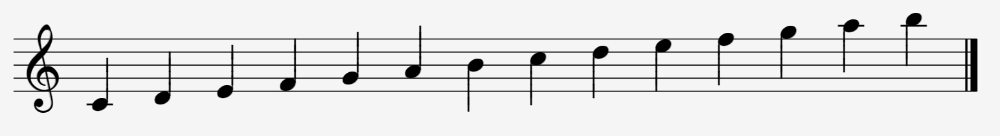
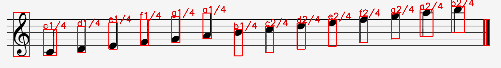
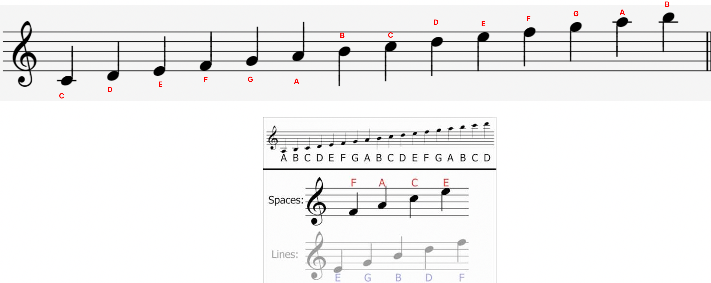

# MusicNotesML
OMR models for MusicNotes hackthon project at Microsoft Student Hackthon
This model and augmentation scripts a refactored version of https://github.com/aashrafh/Mozart
It will be integrated into a web application with [@stephenjoel2k](https://github.com/Stephenjoel2k/MusicNotes)
frontend. 

### Demo 

**Input**

**output**

**Scale**
